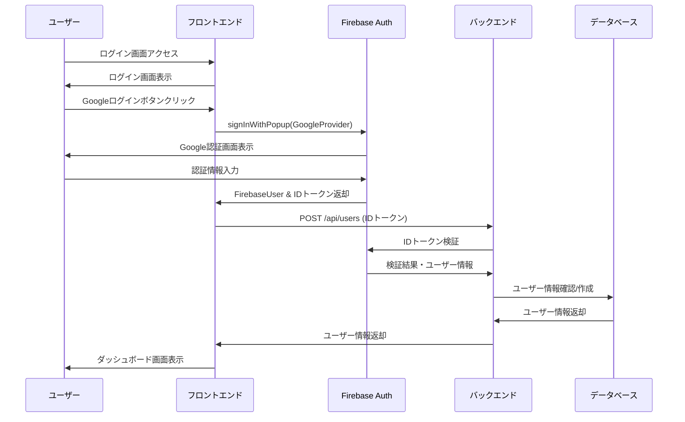
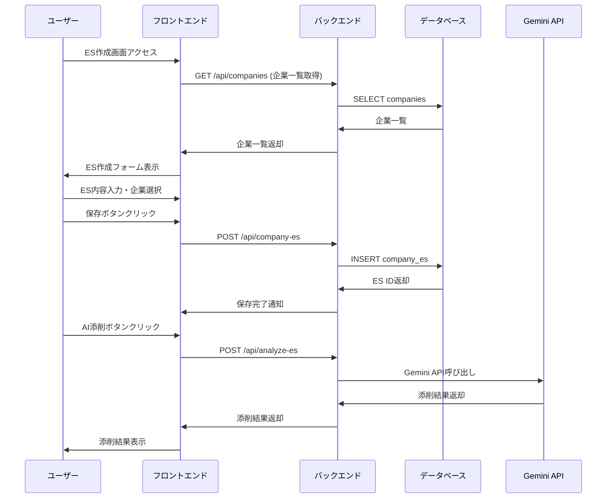
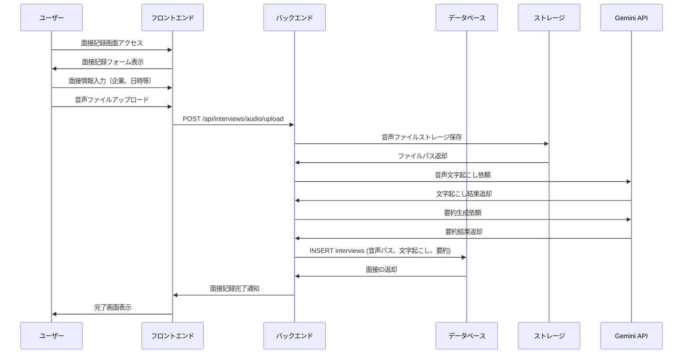
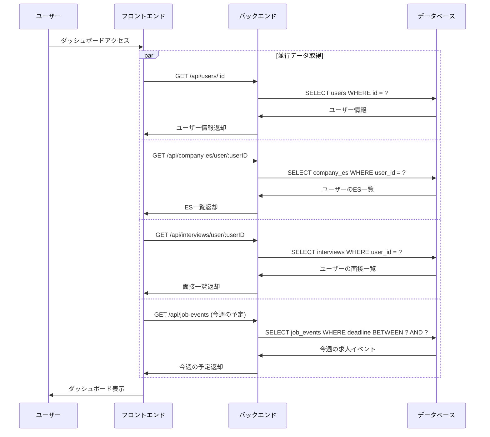
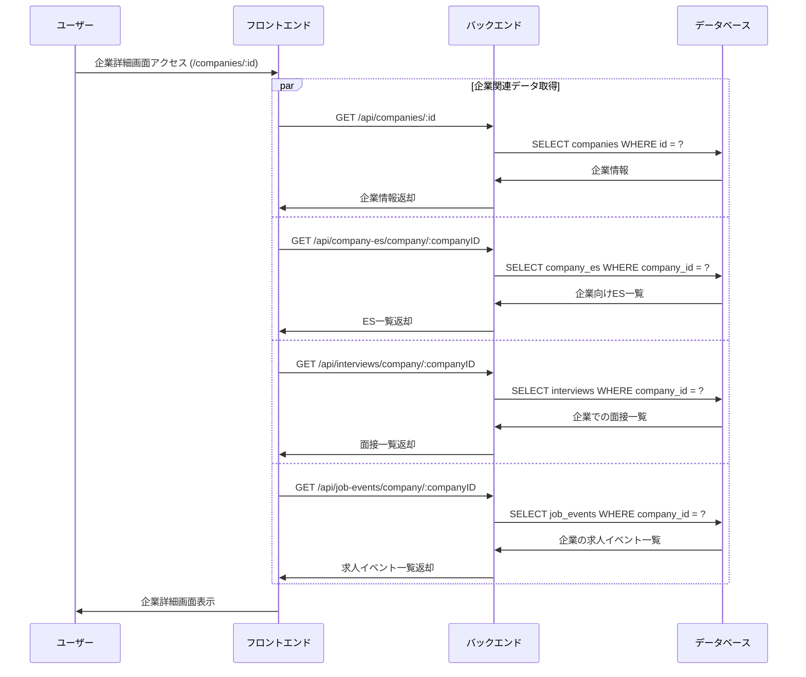
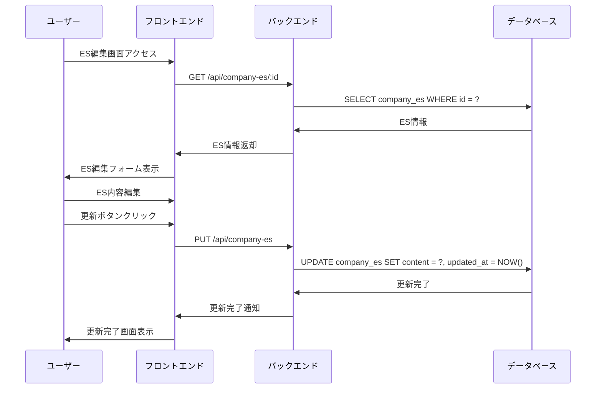
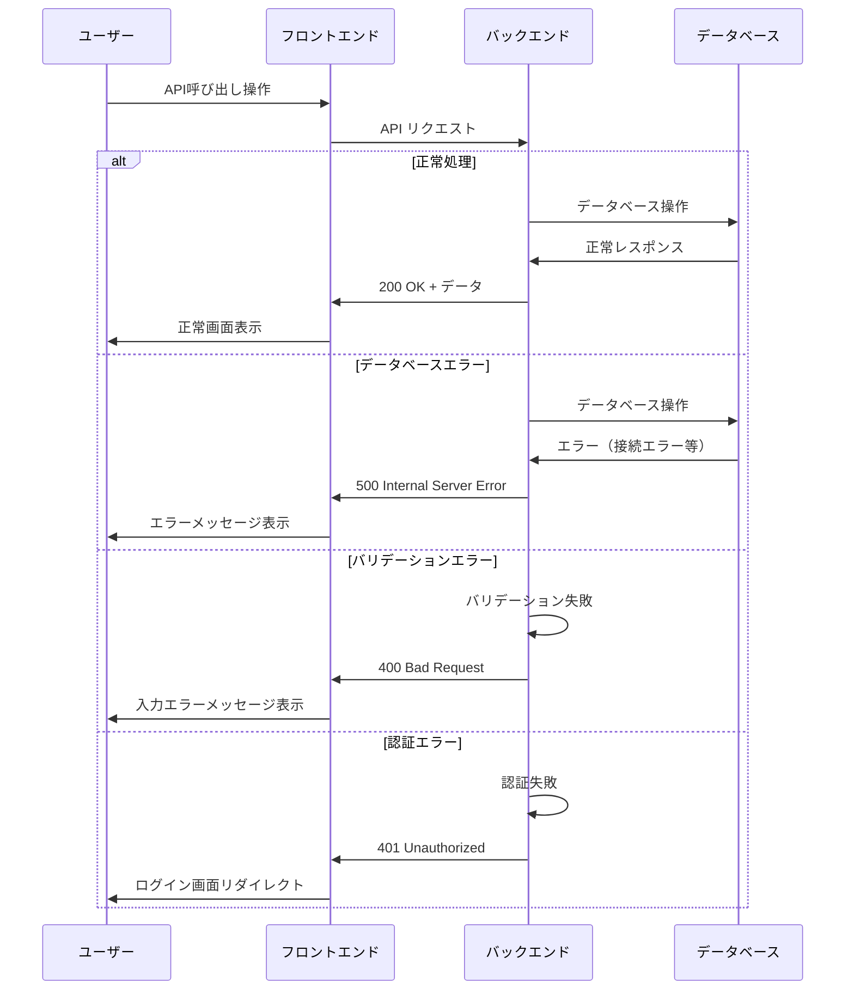

# シーケンス図

## 概要
就活サポートサービスの主要な機能に関するシーケンス図を示します。

## 1. ユーザー登録・ログインフロー

## 2. ES作成・AI添削フロー

## 3. 面接記録・音声要約フロー

## 4. ダッシュボード表示フロー

## 5. 企業別情報表示フロー

## 6. データ更新フロー（ES編集）

## 7. エラーハンドリングフロー

## 注意事項

- すべてのAPI呼び出しにはFirebase IDトークンによる認証が必要
- バックエンドではFirebase Admin SDKを使用してIDトークンを検証
- エラーハンドリングは各フローで適切に実装する必要がある
- AI APIの呼び出しは非同期処理として実装し、タイムアウト対策も考慮する
- ファイルアップロードは適切なサイズ制限とファイル形式チェックを行う